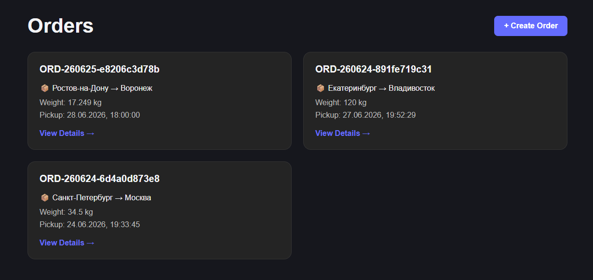
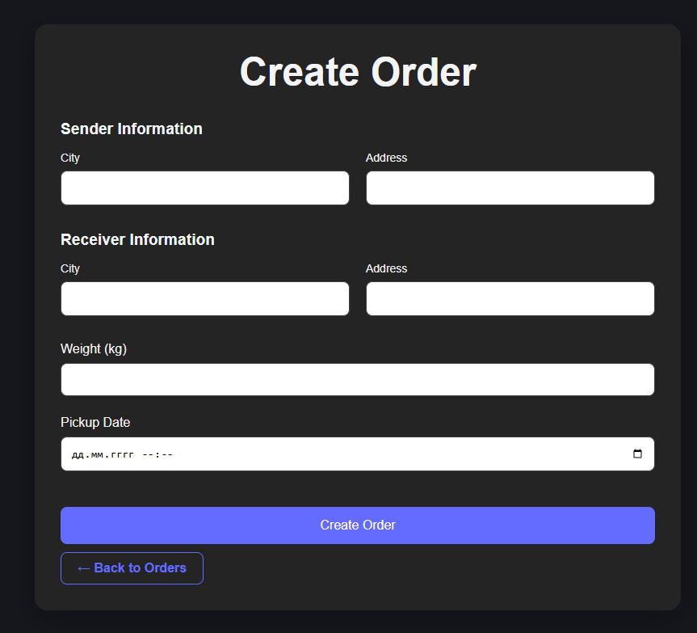
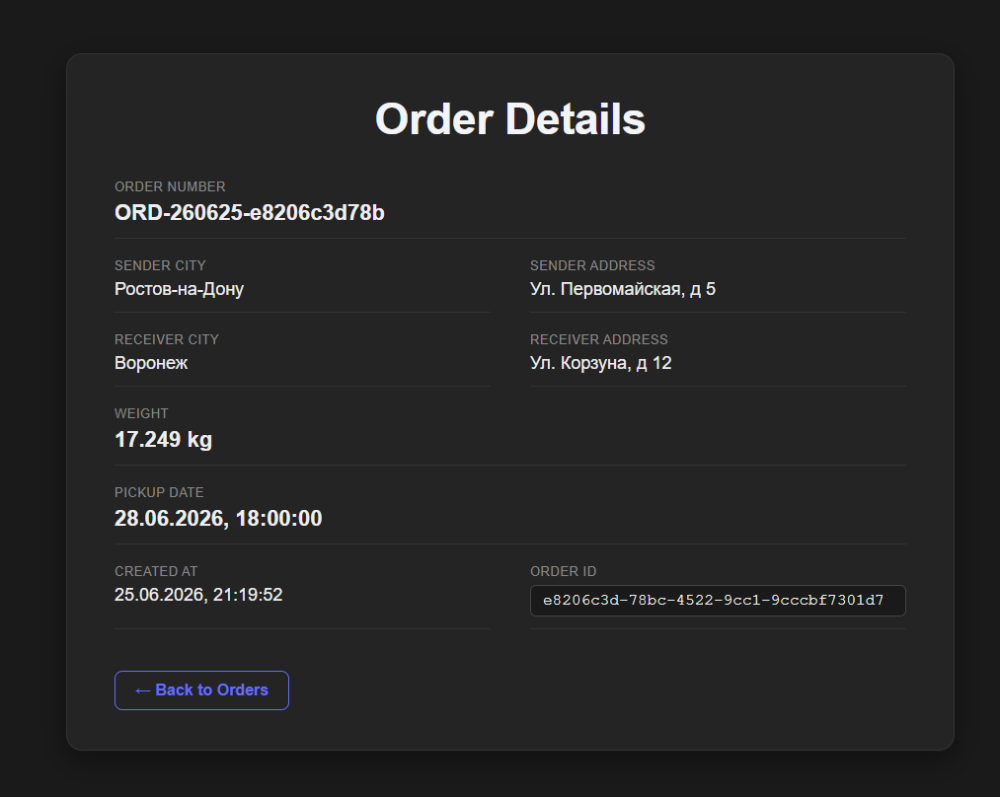
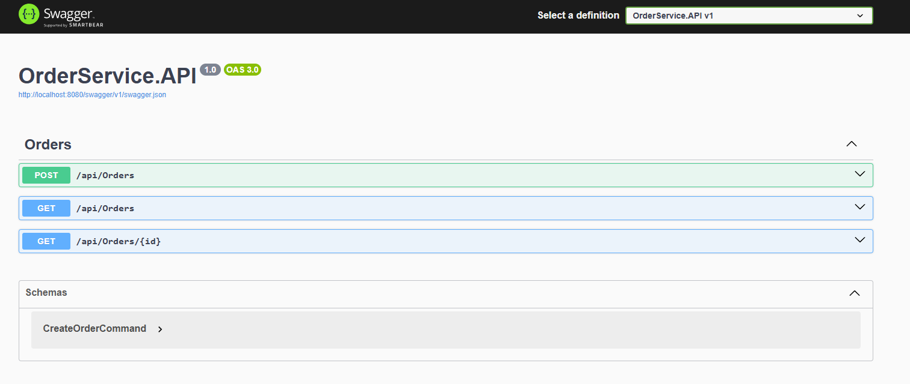

# Order Delivery Management System


A full-stack delivery order management system developed as a test assignment.

The project demonstrates modern **ASP.NET 9** backend development using **Clean Architecture**, **CQRS**, **MediatR**, **Entity Framework Core**, **PostgreSQL**, **React**, **TypeScript**, and **Docker Compose**.

---

# Project Status

* ✅ Backend completed
* ✅ Frontend completed
* ✅ Dockerized
* ✅ Automatic Entity Framework Core migrations
* ✅ Unit tests
* ✅ Ready to run with a single command

```bash
docker compose up --build
```

---
# Screenshots

## Orders List



---

## Create Order



---

## Order Details



---

## Swagger



---


# System Overview

```text
                 Docker Compose
                       │
        ┌──────────────┴──────────────┐
        │                             │
        ▼                             ▼
React + TypeScript              ASP.NET 9 Web API
        │                             │
        └──────────────┬──────────────┘
                       │ HTTP
                       ▼
                  MediatR (CQRS)
                       │
                       ▼
               Application Layer
                       │
                       ▼
                  Domain Layer
                       │
                       ▼
             Infrastructure Layer
                       │
                       ▼
           Entity Framework Core
                       │
                       ▼
                  PostgreSQL 17
```

---

# Features

* Create delivery orders
* View all orders
* View detailed order information
* Domain validation
* CQRS with MediatR
* Swagger API documentation
* Automatic database migrations
* Docker Compose support
* Responsive React frontend

---


# Architecture

## Request Flow

```text
Client
    │
    ▼
OrdersController
    │
    ▼
MediatR
    │
    ▼
Command / Query Handler
    │
    ▼
Repository
    │
    ▼
Entity Framework Core
    │
    ▼
PostgreSQL
```

---

## Clean Architecture

```text
┌─────────────────────────────┐
│          API Layer          │
├─────────────────────────────┤
│      Application Layer      │
├─────────────────────────────┤
│         Domain Layer        │
├─────────────────────────────┤
│    Infrastructure Layer     │
└─────────────────────────────┘
```

---

# Solution Structure

```text
.
├── frontend
│   ├── src
│   └── Dockerfile
│
├── src
│   ├── OrderService.API
│   ├── OrderService.Application
│   ├── OrderService.Domain
│   └── OrderService.Infrastructure
│
├── tests
│   └── OrderService.Domain.Tests
│
├── compose.yaml
├── README.md
└── docs
```

---

# Technology Stack

## Backend

* ASP.NET 9
* Entity Framework Core
* PostgreSQL
* MediatR
* CQRS
* Clean Architecture
* Result Pattern
* Swagger / OpenAPI

## Frontend

* React
* TypeScript
* Axios
* React Router

## Infrastructure

* Docker
* Docker Compose
* Nginx

## Testing

* xUnit
* FluentAssertions

---

# Design Decisions

## Result Pattern

Business validation errors are handled using a custom Result Pattern instead of exceptions.

```csharp
var result = Order.Create(
    senderCity,
    senderAddress,
    receiverCity,
    receiverAddress,
    weight,
    pickupDate);

if (result.IsFailure)
{
    return result.Error;
}
```

---

## CQRS + MediatR

Commands and queries are separated using MediatR.

```text
Controller
    ↓
MediatR
    ↓
Handler
    ↓
Repository
    ↓
Database
```

---

# Running the Application

## Prerequisites

* Docker Desktop

No local installation of PostgreSQL, .NET SDK, or Node.js is required.

---

## Start the application

```bash
docker compose up --build
```

Docker Compose automatically:

* Starts PostgreSQL
* Starts ASP.NET Web API
* Starts the React frontend
* Applies Entity Framework Core migrations
* Serves the application

---

# Application URLs

| Service  | URL                              |
| -------- | -------------------------------- |
| Frontend | http://localhost:5173            |
| Swagger  | http://localhost:8080/swagger    |


---

# API Endpoints

| Method | Endpoint         | Description     |
| ------ | ---------------- | --------------- |
| POST   | /api/orders      | Create Order    |
| GET    | /api/orders      | Get All Orders  |
| GET    | /api/orders/{id} | Get Order By Id |

---

# Error Handling

The API uses a custom Result Pattern together with centralized error mapping.

| Error            | HTTP Status               |
| ---------------- | ------------------------- |
| Validation Error | 400 Bad Request           |
| Order Not Found  | 404 Not Found             |
| Unexpected Error | 500 Internal Server Error |

---

# Testing

Run all tests:

```bash
dotnet test
```

Current unit tests cover:

* Successful order creation
* Invalid city validation
* Invalid address validation
* Invalid weight validation
* Invalid pickup date validation

---

# Future Improvements

* Integration Tests
* Pagination
* Filtering
* Order Status Tracking
* Authentication & Authorization

---

# Author

Developed as a test assignment.
